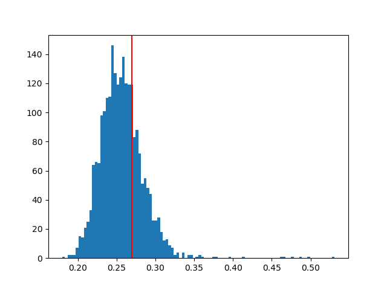
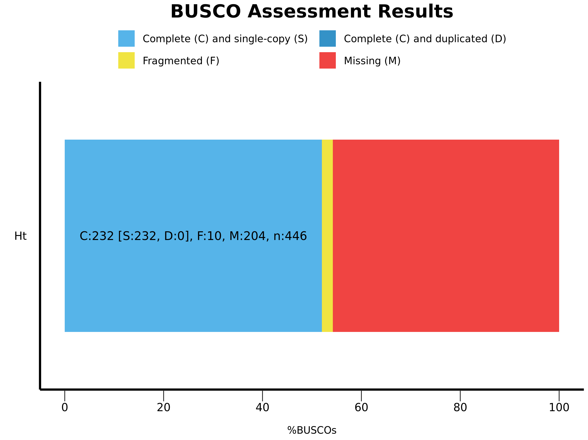

# The origin of human malaria

The species - belonging to the genera *Plasmodium* - that causes most malaria infections in humans is *Plasmodium falciparum*. Working with a set of genomes from *Plasmodium* parasites, including a newly sequenced species - *Haemoproteus tartakovskyi* - that infects birds, we try to uncover the phylogeny of the human pathogen. 

## Directory tree
```bash
.
├── README.md
├── Snakefile
├── bin
│   ├── QC.sh
│   ├── cleanAves.sh
│   ├── consensusTree.sh
│   ├── createPhyloTree.sh
│   ├── genePred.sh
│   ├── getOrtho.sh
│   ├── gffParse.pl
│   └── removeScaffold.py
├── data
│   ├── 00_raw
│   ├── 01_uniprot
│   ├── 02_clean
│   └── 03_busco_downloads
├── environment.yml
├── results
│   ├── 01_QC
│   ├── 02_gene_prediction
│   ├── 03_BLASTP
│   ├── 04_BUSCO
│   ├── 05_ORTHO
│   ├── 06_PHYLO
│   └── 07_CONTREE
└── workflow.sh
```
## Set up the environment
Download and install mamba through the recommended miniforge [installation](https://github.com/conda-forge/miniforge) process.
```bash
wget https://github.com/conda-forge/miniforge/releases/latest/download/Miniforge3-Linux-x86_64.sh
bash Miniforge3-Linux-x86_64.sh
```
Then, use mamba to set up the Snakemake environment, to run the scripts.
```bash
mamba create -c conda-forge -c bioconda -n snakemake snakemake
mamba activate snakemake
```
## Usage
After the environment is all set up, we can run the whole script to go through the analysis process.
```bash
snakemake -p -j 16
# where -j [--cores] is a mandatory argument assigning the number of cores for parallel computations
#       --config is a user argument to select which genome should be addressed for cleaning 
```
The [`snakefile`](Snakefile), while being run creates is own environment - called 'malaria' - based on the `environment.yml` file, in which the following programs are installed:
```bash
# packages in environment at /root/miniforge3/envs/malaria:
#
# Name                    Version                   Build  Channel
bbmap                     39.06                h92535d8_0    bioconda
busco                     5.6.1              pyhdfd78af_0    bioconda
clustalo                  1.2.4                hdbdd923_7    bioconda
diamond                   2.1.8                h43eeafb_0    bioconda
iqtree                    2.3.0                h21ec9f0_0    bioconda
phylip                    3.697                h470a237_0    bioconda
proteinortho              6.3.1                h70414c8_0    bioconda
python                    3.9.18          h0755675_1_cpython    conda-forge
seqkit                    2.7.0                h9ee0642_0    bioconda
```

## Quality check

After a quick preliminary quality check we can realise that one of the genome files has an errorenous format with the fasta header lines being repeated, that we have to correct before running anything:
```bash  
awk -v pattern="^>" '{print} $0 ~ pattern {getline; next}' Plasmodium_knowlesi.genome
```

Consequentially, we can run an initial quality control (QC) check on the genome file using the `stats` function from the seqkit package (v.2.7.0). As an intermediate rule of the snakemake pipeline we call the QC.sh script from the /bin folder to execute the quality check:

```bash
# Running the seqkit stats function
seqkit stats $file -Ta >> ${out_dir}/stats.txt
# End then cleaning up the output table with awk
awk 'NR==1 || NR%2==0' ${out_dir}/stats.txt | awk -F'\t' -v OFS='\t' '{sub(".*/", "", $1)} 1' > $out_dir1/stats_table.tsv 
```
| **file**                             | **format** | **type** | **num_seqs** | **sum_len**   | **min_len** | **avg_len**  | **max_len**  | **N50**     |  **GC(%)** |
|--------------------------------------|------------|----------|--------------|---------------|------------|--------------|--------------|-------------|------------|
| Haemoproteus_tartakovskyi.genome | FASTA  | DNA  | 15048    | 27426784  | 100     | 1822.6   | 64494    | 5219    | 27.40 |
| Plasmodium_berghei.genome        | FASTA  | DNA  | 7479     | 17954629  | 22      | 2400.7   | 37075    | 4226    | 23.71 |
| Plasmodium_cynomolgi.genome      | FASTA  | DNA  | 1663     | 26181343  | 1000    | 15743.4  | 3118530  | 1717921 | 39.08 |
| Plasmodium_faciparum.genome      | FASTA  | DNA  | 15       | 23270305  | 5967    | 1551353.7| 3291871  | 1687655 | 19.36 |
| Plasmodium_knowlesi.genome       | FASTA  | DNA  | 14       | 23462187  | 726886  | 1675870.5| 3159095  | 2147124 | 37.54 |
| Plasmodium_vivax.genome          | FASTA  | DNA  | 2747     | 27007701  | 200     | 9831.7   | 3120417  | 1678596 | 42.20 |
| Plasmodium_yoelii.genome         | FASTA  | DNA  | 130      | 22222369  | 1006    | 170941.3 | 2606237  | 1027135 | 20.78 |
| Toxoplasma_gondii.genome         | FASTA  | DNA  | 2290     | 128105889 | 207     | 55941.4  | 7486190  | 5069724 | 52.20 |

We can see there are huge differences in the scaffold sizes of the assemblies and between the GC content of the individual species' genomic sequences as well.

## Predicting genes

The gene prediction step was executed from the Genemark-ES.hmm3 algorithm from the gmes suite using the `gmes_petap.pl` function. It is a rather time consuming step as well as the suite requires a licence to allow usage, hence this step must be run on the university servers. Considering that there was many assemblies with low contig length, I used a low contig length of 1000 for the initial round of gene prediction.  As an intermediate rule of the snakemake pipeline we call the genePred.sh script from the /bin folder to execute the quality check:

```bash
# Running the Genemark-ES.hmm3 algorithm
gmes_petap.pl --ES --min_contig ${min_contig} --cores 100 --sequence ${f} --work_dir ${wd}
# --min_contig was set to 1000, individual output directories were created for each species 
# using their initials - e.g., Haemoproteus tartakovskyi => Ht
```
Because `gmes_petap.pl` attaches extra information to the header of the fasta sequences on its output .gtf file, we have to execute an extra step to remove these for further steps of the workflow. Otherwise, we will face compatibility issues. I used a for loop to copy and modify each output .gtf file:
```bash
# Visit the output directory, move the gene prediction files to the main output directory
for d in ${out_dir}/*; do
    echo "$out_dir"
    if [ -d "$d" ]; then
        species=$(basename $d)
        cat ${out_dir}/${d}/genemark.gtf | sed -e "s/\s*length=[[:digit:]]*.*numreads=[[:digit:]]*\b//gm" > ${out_dir}/genemark.${species}.gtf
        # remove the length and numreads labels and rename the files to include the species names
    fi
done
```

## Removing contamination from avian hosts from the *H. tartakovskyi* genome

To execute this action, the cleanAves.sh script was called from the bin/ folder during during the next rule in the Snakefile workflow. This script is used to remove contigs from the genome assembly that map to bird genomes! It takes the assembly in fasta format and a gtf file as input and outputs a filtered genome assembly in fasta format. The script uses the custom scripts removeScaffold.py and gffParser.pl:

1. removeScaffold.py is used to remove contigs below a given GC threshold and length 
```bash
# Run the removeScaffold.py script
python bin/removeScaffold.py $fasta $gc_threshold $gene_dir/$output"_GC"$gc_threshold 3000
# removeScaffold.py usage: removeScaffolds.py [arg1] [arg2] [arg3] [arg4]
#   -   sys.argv[1] is input fasta file name
#   -   sys.argv[2] is threshold GC content as integer
#   -   sys.argv[3] is the output file
#   -   sys.argv[4] is the minimum length for scaffolds to keep
```
2. gffParser.pl is used to extract hypothetical proteins from the genome assembly.
```bash
# Run the gffParser.pl script
perl bin/gffParse.pl -i $gene_dir/$output"_GC"$gc_threshold".fa" -g $gtf -d $gene_dir/pred -b $output"_GC"$gc_threshold"_pred" -p -c    
# gffParser.py usage: gffParser.py -i -g -d -b -p* -c*
#   -   [-i] input fasta file
#   -   [-g] input gff file
#   -   [-d] output directory (MUST BE A NEW DIRECTORY)
#   -   [-b] output basename
#   -   [-p] if set the program outputs a protein file
#   -   [-c] if set, when an internal stop codon is found the program will try the next reading frame
```
The removeScaffold script already executes a prefiltration step to remove short sequences and sequences with a GC bias different from the species *H. tartakovskyi*. I selected to exclude anything above the mean GC (27%). 


Then, the script uses blastp to compare the proteins to the bird protein database downloaded from SwissProt and removes contigs that match any bird proteins among the top 5 hits. With 16 cores the blast search takes hours to run, using 160 cores on the server it was done within a few minutes. The bird database that has been used to select matching hits was download from UniProtDB. Taxonomy filter was set to taxid=8782 (Aves) and the resulting table was downloaded - `uniprotkb_taxid_aves.tsv`: including around 5.7 million proteins.

```bash
# Run blastp to compare the proteins to the bird protein database
blastp -query $gene_dir/$output"_GC"$gc_threshold"_pred.faa" -db SwissProt -outfmt 6 \
    -num_threads 160 -evalue 0.05 -out $blast_dir/$output"_GC"$gc_threshold"_hits.tsv" 
    # evalue cutoff is set to 0.05; the output format is tabular (6); the number of threads is set to 16
```

Removing contigs with bird protein encoding genes in case of using a GC threshold of 27, there were 5074 scaffolds containing 6736 genes. Searching for proteins, where bird was among the top 5 hits, 67 (1.35%) scaffold were excluded. The top 5 hits excluded less than 2% of the contigs, hence I went with it end removed these contigs from the genome that has been previously filtered for GC content and assembly length previously. This step removed 5.47% of the total sequences, together with the GC and length filter 57.8% of the original assemlby was got filtered out.

```bash
cat $blast_dir/$output"_GC"$gc_threshold"_hits.tsv" |\
     awk 'NR==1 {value=$1; count=1} $1!=value {value=$1; count=1} $1==value && count<=5 {print; count++}' |\
     grep -Ff <(cut -f2 $bird_db) | cut -f1 | sort | uniq > $filtered_dir/$output"_GC"$gc_threshold"_genes.txt"
    # Find the contigs where the genes encoding these proteins are located
    cat $gtf | grep -wFf $filtered_dir/$output"_GC"$gc_threshold"_genes.txt" | cut -f1 | sort | uniq >\
     $filtered_dir/$output"_GC"$gc_threshold"_contigs.txt"
    # Remove these contigs from the genome assembly
    cat $gene_dir/$output"_GC"$gc_threshold".fa" |\
        grep -vFf $filtered_dir/$output"_GC"$gc_threshold"_contigs.txt" | grep -A 1 "^>" --no-group-separator >\
        $filtered_dir/$(basename $fasta)
```
Let's compare the statistics of the raw and the clean *H. tartakovsky* genome:
| name     | n_contigs | contig_bp | ctg_N50 | ctg_L50 | ctg_N90 | ctg_L90 | ctg_max | gc_avg  | gc_std |
|----------|-----------|-----------|---------|---------|---------|---------|---------|---------|--------|
| Ht.raw   | 15048     | 27426710  | 1371    |5219     | 7572    | 721     | 64494   | 0.274   | 0.107  |
| Ht.clean | 1638      | 11558224  | 462     | 7984    | 1299    | 3852    | 42559   | 0.247   | 0.017  |

## BUSCO analysis of the clean genomes

BUSCO (*Benchmarking Universal Single-Copy Orthologs*) analysis is a widely adopted and powerful tool for assessing the quality and completeness of genome assemblies. Here, we scan the genome assemblies for the predefined set of single-copy orthologous genes in [apicomplexa_odb10](https://busco.ezlab.org/list_of_lineages.html), that should be present in all members of a taxonomic lineage of malaria causing parasites (Creation date: 2024-01-08, number of genomes: 54, number of BUSCOs: 446).

The BUSCO analysis step is part of the `getOrtho.sh` script:
```bash
# Run BUSCO analysis on the gene predictions for each species
for f in $input_dir/*; do
    if [ -f "$f" ]; then
        echo "Running BUSCO on $(basename $f)"
        output=$(get_initials "$(basename $f)")
        # run busco
        busco -i $f --out "$busco_dir/$output.genome" -m genome -c 8 -l "$busco_db/apicomplexa_odb10"
        generate_plot.py -wd "$busco_dir/$output.genome" 
        # move the plot and the summary to the main busco directory
        mv "$busco_dir/$output/"*.png "$busco_dir/$output"_genome.png
        mv "$busco_dir/$output/"*.txt "$busco_dir/$output"_genome_summary.txt
    fi
done
```
The results of the BUSCO analysis suggest that there has been some problems while assemlbing the genome of *H. tartakovsky* and the outgroup *Toxoplasma gondii*. In the case of *H. tartakovsky* there is a high number of missing BUSCO genes (missing: 45.8%), that means that although we successfully executed the host-decontamination - as there was not a singly duplicated, complete gene - we still discarded a significant percent of the parasites own genetic material as well. The problems, in the case of *T. gondii* arise from a different source. Here, we found 97.3% of the BUSCO genes in the assembly, however all of them was presented in duplicated copies. This high numbers of duplicated genes may indicate issues with the assembly process, such as collapsed repeats or other host contamination. 

| Species | Complete, single-copy (S) | Complete and duplicated (D) | Fragmented (F) | Missing (M)   | 
|---------|---------------------------|-----------------------------|----------------|---------------|
| $${\color{red}Ht}$$ | **232 (52.2%)** | **0 (0%)**                | **10 (2.2%)**   | **204 (45.8%)** |
| Pb      | 363 (81.4%)               | 11 (2.5%)                   | 52 (11.7%)      | 20 (4.4%)    |
| Pc      | 439 (98.4%)               | 0 (0%)                      | 7 (1.6%)        | 0 (0%)       |
| Pf      | 444 (99.6%)               | 0 (0%)                      | 1 (0.2%)        | 1 (0.2%)     |
| Pk      | 442 (99.1%)               | 0 (0%)                      | 1 (0.2%)        | 3 (0.7%)     |
| Pv      | 441 (98.9%)               | 2 (0.4%)                    | 3 (0.7%)        | 0 (0%)       |
| Py      | 443 (99.3%)               | 0 (0%)                      | 2 (0.4%)        | 1 (0.2%)     |
| $${\color{red}Tg}$$ | **0 (0%)**    | **434 (97.3%)**             | **8 (1.8%)**    | **4 (0.9%)** |



## Orthologous proteins across the taxa

Consequentially, we rerun the `gffParse.pl` script on the clean *H. tartakovsky* genome as well as the rest of the species to extract the protein coding DNA sequences and the amino acid sequences as well. Then, performed an orthology search with [proteinortho](https://gitlab.com/paulklemm_PHD/proteinortho) (v.6.3.1) to find significant groups based on sequence similarity. This step was still part of the `getOrtho.sh` script.

```bash
# Call proteinortho to find orthologs using brace expansion.
proteinortho6.pl -project=Malaria_phylo $ortho_dir/{Ht,Pb,Pc,Pf,Pk,Pv,Py,Tg}.fixed.faa
```
Furthermore, I also executed a second BUSCO analysis on the produced protein sequence files. The results were very somolar to the ones we have seen during the previous steps. Moving forward I used both the BUSCO results and the Proteinortho results to find orthologous genes for phylogenetic tree creation. In case of the BUSCO genes I followed two approaches:
1. selected those completed and single-copy (S) BUSCO genes that were present in across all eight taxa
2. excluded *T. gondii* from the analysis and used BUSCO (S) genes across the rest of the taxa

The first method only yielded 2 genes, as the rest of the proteins were duplicated in *T. gondii*. The second method resulted in 136 genes. The two proteins present across all taxa have been:

| ID          | Description                                   | AIC       |
|-------------|-----------------------------------------------|-----------|
| 8677at5794  | ATPase family AAA domain-containing protein 3 | -9995.394 |
| 24023at5794 | PUA domain                                    | -6433.9   |

```bash
# Define the path to the full_table.tsv file
tsv_path="run_apicomplexa_odb10/full_table.tsv"

# Extract the complete and fragmented BUSCO genes found in all taxa
for taxa in {Ht,Pb,Pc,Pf,Pk,Pv,Py,Tg}; do
    echo "Extracting complete and fragmented BUSCO genes from $taxa"

    if [ ! -f "$output_dir/complete.tsv" ]; then
        echo -e "taxa\tgene" > $output_dir/complete.tsv
    fi

     # Extract the complete BUSCO genes
    cat ${input_dir}/${taxa}.protein/${tsv_path} $output_dir |\
    awk -v taxon=$taxa 'BEGIN{FS="\t"; OFS="\t"}{if($2 == "Complete") print taxon, $1}' >> $output_dir/complete.tsv    
done

# Store the complete BUSCO genes name present in all taxa
cat $output_dir/complete.tsv | cut -f2 | sort | uniq -c |\
awk '$1 == 8 {print $2}' > $output_dir/all_shared_ortho.tsv


mkdir -p ${output_dir}/sequences
# find the corresponding sequences 
while read gene; do
    echo "Extracting sequences for $gene"
    # First hit for each taxa (every nucleotide sequence was duplicated in Tg)
    grep -w $gene $output_dir/complete.tsv | cut -f1 | while read taxa; do
        grep -w $gene ${input_dir}/${taxa}.protein/${tsv_path} | cut -f3 | head -1 | while read seq_id; do
            # create multi-fasta file with the matching sequences
            grep --no-group-separator -A1 -w $seq_id ${protein_dir}/${taxa}.fixed.faa >> $output_dir/sequences/$gene.faa
        done
    done
done < $output_dir/all_shared_ortho.tsv
```
In contrary, when working with the ProteinOrtho outputs I used clusters, which contained one gene from each taxon and where the sequence similarity was over 70% across all species. With this approach I found seven such clusters for phylogenetic tree creation:

| cluster  | Alg.-Conn. | sequences | Description | AIC |
|----------|:----------:|-----------|-------------|-----|
| Group317 | 0.75       | 272_g_Ht,3054_g_Pb,571_g_Pc,3594_g_Pf,591_g_Pk,551_g_Pv,4261_g_Py,7471_g_Tg  | Methylthiotransferase, N-terminal | -10407.905 |
| Group316 | 0.75       | 1603_g_Ht,1584_g_Pb,2940_g_Pc,1145_g_Pf,3037_g_Pk,2912_g_Pv,3372_g_Py,11682_g_Tg | | -10354.286 |
| Group315 | 0.75       | 1202_g_Ht,2842_g_Pb,1544_g_Pc,1620_g_Pf,1605_g_Pk,1522_g_Pv,2698_g_Py,12004_g_Tg | Cyclic nucleotide-binding, conserved site | -7791.550  |
| Group311 | 1          | 1328_g_Ht,4351_g_Pb,2239_g_Pc,2238_g_Pf,2313_g_Pk,2200_g_Pv,1296_g_Py,4158_g_Tg  | -4663.740  | 
| Group312 | 1          | 346_g_Ht,3769_g_Pb,2103_g_Pc,805_g_Pf,2164_g_Pk,2063_g_Pv,1162_g_Py,8008_g_Tg  | | -4263.997  |
| Group313 | 1          | 76_g_Ht,3353_g_Pb,592_g_Pc,3574_g_Pf,613_g_Pk,570_g_Pv,4281_g_Py,8640_g_Tg | Matrin/U1-C-like, C2H2-type zinc finger | -2532.645  |
| Group314 | 1          | 909_g_Ht,3720_g_Pb,1029_g_Pc,239_g_Pf,1070_g_Pk,1013_g_Pv,401_g_Py,12407_g_Tg | | -2241.070  |

## Creating phylogenetic trees

First, I created multiple sequence alignments files from the multi-fasta files using `clustalo` (v1.2.4) with automatically set options (`--auto`).
```bash
# Run Clustal Omega to align the sequences
mkdir -p ${output_dir}/alignments

for f in $output_dir/sequences/*; do
    if [ -f "$f" ]; then
        echo "Aligning $f"
        clustalo -i $f -o ${output_dir}/alignments/$(basename $f .faa).aln --auto
    fi
done
```
Then, using iqtree I generated the phylogenetic trees using 1000 bootstraps and executing extended modell selection (`-m MFP`) to find the best modell by tree inference.
```bash
# Create a tree from the alignments using iqtree
mkdir -p ${output_dir}/tree

for f in $output_dir/alignments/*; do
    if [ -f "$f" ]; then
        echo "Creating tree from $f"
        mkdir -p ${output_dir}/tree/$(basename $f .aln)
        iqtree -s $f -m MFP -bb 1000 -nt AUTO -pre ${output_dir}/tree/$(basename $f .aln)/$(basename $f .aln)
    fi
done
# Extract the AICs from the log files
grep -oP "(?<=BEST SCORE FOUND : ).+" $(find ${output_dir}/tree/ -name *.log) | tr ":" "\t" |\
sort -n -k2 > ${output_dir}/AICs_full.txt
```
All three resulting tree placed the organisms similarly, suggesting that the main human parasite *P. falciparum* evolved early from the *Plasmodium* genus, either directly from a shared ancestor with the avian parasite *H. tartakovsky* or later on sharing a closest common ancestor with the rodent parasites *P. yoelii* and *P. berghei*, instead of other Plasmodia that can be infectious to humans (*P. knowlesi*, *P. cynomolgi* or *P. vivax*).

1. Tree based on the two collectively shared BUSCO genes:


2. Tree based on shared BUSCO genes, excluding the out-group *T. gondii*:


3. Tree based on the ProteinOrtho clusters:


