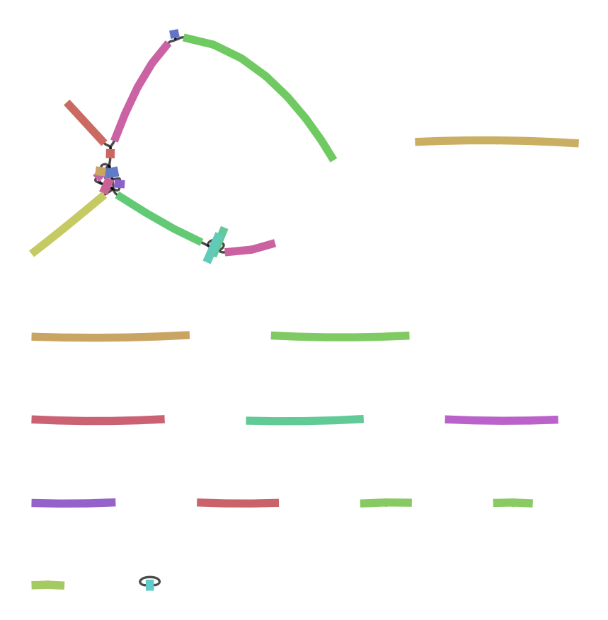
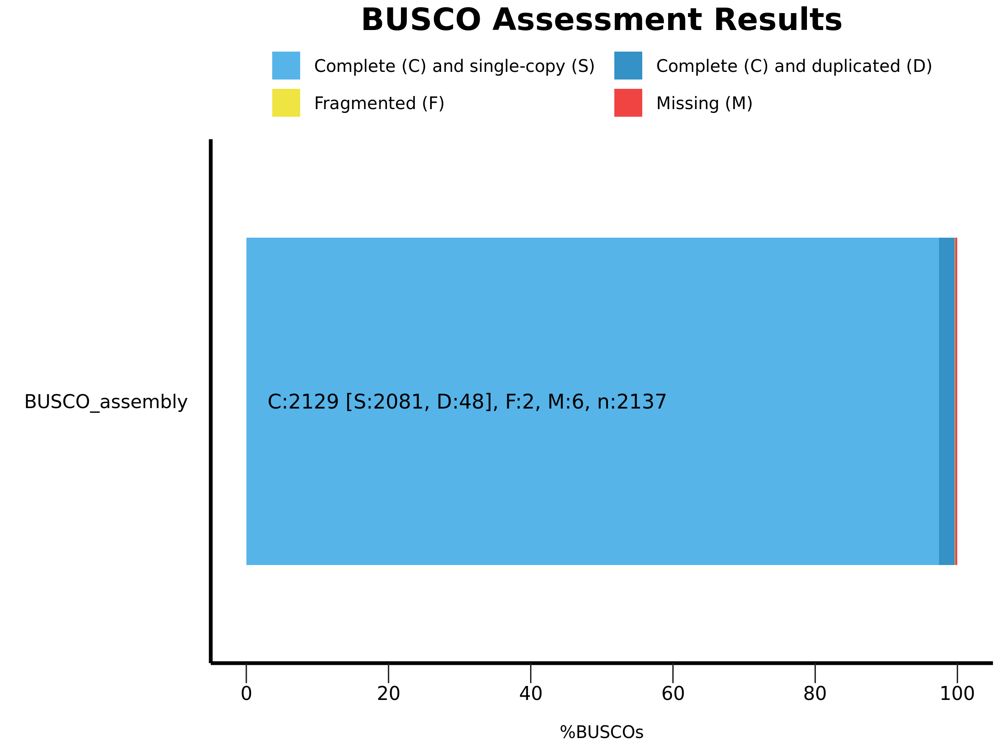

# De novo sequencing project

## Directory tree
```bash
.
├── README.md
├── data/
│   ├── GCF_000146045.2_R64_genomic.fna
│   └── SRR13577846_1.fastq
├── results/
│   ├── 00_fastqc/
│   │   ├── multiqc_data/
│   │   └── multiqc_report.html
│   ├── 01_quality/
│   ├── 02_assembly/
│   │   ├── 00-assembly/
│   │   ├── 10-consensus/
│   │   ├── 20-repeat/
│   │   ├── 30-contigger/
│   │   ├── 40-polishing/
│   │   ├── assembly.fasta
│   │   ├── flye.log
│   └── 03_quast/
│       ├── aligned_stats/
│       ├── basic_stats/
│       ├── contigs_reports/
│       ├── genome_stats/
│       ├── multiqc_data/
│       ├── multiqc_report.html
│       ├── report.txt
├── environment.yml
└── workflow.sh
```
## Set up the environment
Download and install mamba through the recommended miniforge [installation](https://github.com/conda-forge/miniforge) process.
```bash
wget https://github.com/conda-forge/miniforge/releases/latest/download/Miniforge3-Linux-x86_64.sh
bash Miniforge3-Linux-x86_64.sh
```
Then, use mamba to set up the environment based on the *.yaml* file.
```bash
mamba create --name denovo --no-default-packages
mamba env update -n denovo --file denovo.yml
mamba activate denovo
```
## Usage
After the environment is all set up, we can run the whole script to go through the analysis process.
```bash
bash workflow.sh SRR13577846 #SRR code for sample
```
## 1. Data acquisition
I downloaded the sequence file - SRR13577846 - from NCBI's sequence read archive ([SRA](https://trace.ncbi.nlm.nih.gov/Traces/?view=run_browser&acc=SRR13577846&display=metadata)) database, made the file(s) write-protected from all users and groups and. The raw data files are added to the `.gitignore` file to keep them from being uploaded to GitHub.
```bash
prefetch SRR13577846 -O data
fastq-dump --split-files data/SRR13577846 -O data/
chmod -R a-wx data/

cd data && wget ftp://ftp.ncbi.nlm.nih.gov/genomes/all/GCF/000/146/045/GCF_000146045.2_R64/GCF_000146045.2_R64_genomic.fna.gz
```
## 2. Quality control
The quality of the reads was assessed using the fastQC (0.12.1) and multiQC (1.19) tools, the reads were found to be of very high quality and without significant contamination or other source of errors, hence no trimming was done.
```bash
fastqc -o results/00_fastqc -f fastq -t 10 ${indir}/SRR13577846.fastq
```

## 3. Long-read assembly
I chose to work with Flye (v2.9.3) de novo assembler, then execute polishing via QUAST (5.2.0). Even from the project folder on NCBI it was clear that a high-fidelity PacBio sequencing was executed on the genomic DNA, but looking at the QC results, the reads seemed very high quality. Hence, the `--pacbio-hifi` parameter could have been set during the flye assembler step. 
```bash
flye --pacbio-hifi ${indir}/SRR13577846.fastq --out-dir results/02_assembly --threads 10
quast -o results/03_quast  -r ${indir}/reference.fna -t 10 --no-icarus results/02_assembly/assembly.fasta
```
Running the assembler failed on my local machine using 4 threads and 4 Gb-s of RAM, while it took about 22 minutes on the university server using 10 cores. The results were:
| Genome statistics | Results |
|:--|:-:|
| Total length | 12119387 |
| Fragments | 21 |
| N50 | 809075 |
| Largest frg | 1499554 |
| Scaffolds | 0 |
| Mean coverage | 87 |

Visualising de novo assembly graphs with Bandage. 



## 4. BUSCO assessment
We analyze the assembly quality based on the coverage and fragmentation of BUSCO genes using the busco package (v5.6.1). We configure BUSCO with local environment using the `-l saccharomycetes_odb10` parameter to set the lineage datbase to that of the baker's yeasts' (eukaryota, 2024-01-08).
```bash
busco -i ${assembly}/assembly.fasta -m genome -c 12 --out_path ${BUSCO}/ -l saccharomycetes_odb10
generate_plot.py -wd ${BUSCO}/BUSCO_assembly.fasta/
```
|Results from dataset saccharomycetes_odb10        |
|---|
|C:99.6%[S:97.4%,D:2.2%],F:0.1%,M:0.3%,n:2137      |
|2129    Complete BUSCOs (C)                       |
|2081    Complete and single-copy BUSCOs (S)       |
|48    Complete and duplicated BUSCOs (D)          |
|2    Fragmented BUSCOs (F)                        |
|6    Missing BUSCOs (M)                           |
|2137    Total BUSCO groups searched               |




